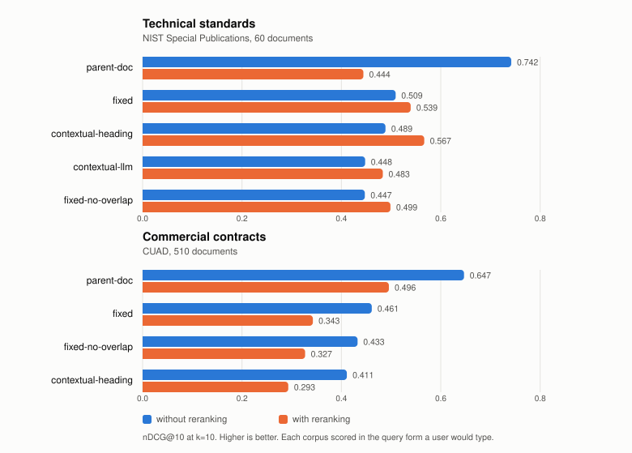

# layoutrag

**A RAG pipeline that audits itself on your documents.**

Every RAG recommendation is published as a universal rule. Add a reranker. Use heading-aware
chunking. Use a layout-aware parser. Measured across two different document sets, each of
those rules reverses.

layoutrag runs the pipeline both ways on your own files and reports which configuration wins
for them.

---

## Overview

```bash
uv run layoutrag cost  ./my-docs                      # price the audit, zero API calls
uv run layoutrag query ./my-docs "what is the notice period?"
uv run layoutrag query ./my-docs "..." --local        # fully offline, no key
```

Runs on your machine. Your documents are never uploaded anywhere.

The pipeline is a normal production RAG stack: parse, chunk, embed, index, search, rerank.
Each stage carries several implementations and a measurement harness, so a configuration can
be scored on your corpus before it is committed to.

---

## The problem this addresses

Published guidance treats pipeline choices as settled. Measured across two document sets,
the same choice helps one and harms the other.

<picture>
  <source media="(prefers-color-scheme: dark)" srcset="docs/results-dark.svg">
  
</picture>

Reranking is the clearest case. It gains up to 8 points on standards and loses 11 to 15 on
contracts, and it takes 30 points off the best strategy on both.

| Technique | Technical standards | Commercial contracts |
|---|---|---|
| Cross-encoder reranking, small chunks | +3 to +8 | **−11 to −12** |
| Cross-encoder reranking, parent-doc | **−29.8** | **−15.1** |
| Heading-aware chunking | −2.0 | −4.9 |
| Contextual LLM enrichment | −6.1 | not measured |
| Layout-model parsing | **−13.1** | not applicable |

Scores are nDCG@10, 0 to 1. Full data in [`results/`](results/).

A pipeline built on published defaults would be correct on one of these corpora and wrong on
the other, with no signal that anything was off. Retrieval degrades quietly.

---

## Findings

### Reranking

A cross-encoder re-reads the top 50 results with the question in hand and reorders them. It
runs locally at no per-query cost.

| Document set | Without reranking | With reranking | Change |
|---|---|---|---|
| Technical standards | 0.436 | **0.570** | **+13.4** |
| Commercial contracts | **0.460** | 0.343 | **−11.8** |

The direction holds across all four chunking strategies within each set, so this is a
property of the documents.

Contracts repeat party names on nearly every page. A query naming the contract scores
similarly against every chunk in it, and the clause-specific part of the question is
diluted. Standards are topically distinct, so there is real signal to reorder on.

**The query passed to the reranker also matters.** On standards, reranking the padded search
query scored 0.346 against 0.570 for the user's question. Search queries are padded with
document identifiers to help the vector stage. A cross-encoder compares the query directly
against each candidate, so that padding matches everything equally. The two queries are kept
separate, and the correct form is selected from the question set at runtime.

### Chunking

Adding the enclosing section heading to each chunk before embedding.

| Document set | Heading-aware | Plain fixed | Change |
|---|---|---|---|
| Standards, real heading formatting | **0.436** | 0.353 | **+8.3** |
| Contracts converted from HTML | 0.411 | **0.460** | **−4.9** |

The contracts carry no heading typography, measured at 0.0 to 0.5% of text objects set above
body size. All 15,013 chunks were flagged as degraded before any score was computed, so the
pipeline identifies this case in advance.

### Parsing

docling, an ML layout model, against font-size heading detection.

| Parser | Score | Headings found | Text recovered | Speed |
|---|---|---|---|---|
| Font-size detection | **0.436** | 478 | 100% | 0.004 s/page |
| docling | 0.305 | 6,579 | 79.2% | 1.03 s/page |

docling identified 13.8x more headings and scored 13.1 points lower. It recovers 79.2% of
the text a basic reader finds, median 86% per document and 17.4% at worst, while reporting
success on every document. Retrieval cannot return an answer that was never indexed.

On born-digital PDFs, font metrics already present in the file outperformed a parser 258x
slower requiring 1 GB of additional dependencies. Its applicable case is scanned documents,
which this audit did not cover.

### Retrieval depth

One chunking strategy led at k=10 while returning 3.5x more text than the others. Scored at
a fixed token budget, its recall fell from 0.772 to 0.381.

Every configuration is scored both ways, so a strategy cannot win by spending more context
than its alternatives.

---

## Running an audit on your documents

```bash
uv run layoutrag cost ./my-docs
```

Reports the token count and price of indexing your corpus under each configuration. No API
calls are made, because chunking is free and produces the exact token counts embedding is
billed for.

```bash
uv run layoutrag query ./my-docs "a real question from your business"
```

Indexes under several chunking strategies simultaneously and returns what each retrieved,
with scores and the document structure behind them.

Supplying labelled questions runs the full scoring harness and produces the tables above for
your corpus. Parsing and chunking are cached by content hash, so comparing configurations
does not reprocess documents.

---

## Pipeline

```
PDF  ->  parse  ->  chunk  ->  embed  ->  index  ->  search  ->  rerank  ->  passages
```

| Stage | Default | Alternatives measured |
|---|---|---|
| Parse | pypdfium2 | plain text, font-size heading detection, docling |
| Chunk | fixed, 512 tokens, 12.5% overlap | no-overlap, heading-aware, parent-document, contextual-llm |
| Embed | text-embedding-3-small | local model, fully offline |
| Index | exact vector search | |
| Search | top 50 by similarity | |
| Rerank | ms-marco-MiniLM-L6-v2, local | disabled |

---

## Evaluation method

**Document sets.** [CUAD](https://www.atticusprojectai.org/cuad): 510 commercial contracts
with clauses annotated under lawyer supervision, CC BY 4.0. NIST Special Publications: 60
technical standards, public domain. Both retrieved by script and not committed here.

**Questions.** 300 derived from CUAD's lawyer annotations. 95 written by hand for NIST after
reading each source passage, deliberately worded away from the source. A model shown a
passage and asked to write a question reuses its vocabulary, after which retrieval succeeds
on word overlap and every configuration scores well for reasons unrelated to the pipeline.

**Relevance.** A result counts when it contains at least half the annotated answer.
Measuring the proportion of the chunk that is relevant would make large chunks structurally
unable to score, and the audit would be measuring chunk size while reporting strategy.
`tests/test_relevance.py` asserts size invariance.

**Search is exact**, so no configuration loses because an approximate index missed a
neighbour.

**No significance testing.** At n=300 the standard error on a paired difference is
approximately ±2.6 points. The 8 to 13 point differences reported here sit well clear of
that. Differences of 2 to 3 points are indicative.

---

## Cost

**$0.73** for the full audit: two document sets, 10 indexes, 112,000 chunks, 32.4M tokens.
Projected at $0.6471 before any API call, actual 1.8% above.

Spending controls are enforced in code:

- every run is priced before it starts, from exact token counts
- per-run and cumulative ceilings, persisted across processes
- a corpus re-embedded in a loop is stopped before it reaches an invoice
- reranking runs locally at no per-query cost

Measured breakdown in [`costs.md`](costs.md).

---

## Coverage

| Stage | Available | Roadmap |
|---|---|---|
| Ingestion | PDF, 3 parsers, 5 chunking strategies, cloud and local embedding | markdown, txt, docx; 3 further chunking strategies; incremental indexing |
| Retrieval | vector search, cross-encoder reranking | BM25 hybrid with RRF, metadata filters |
| Generation | | answer synthesis with citations |
| Interface | command line | web interface |
| Operations | spend ceilings, content-hash caching, resumable processing, progress reporting | |

Answer generation is not yet implemented. The pipeline currently retrieves and ranks
passages.

---

## Limitations

One embedding model, two document sets, no significance testing, no scanned documents, no
generation stage. Cloud embedding models change without notice, so `--local` is the
configuration reproducible over time.

Deliberate exclusions and their reasoning are in
[`not-implemented.md`](not-implemented.md).

---

## Licence

Apache-2.0. Question sets CC BY 4.0.
